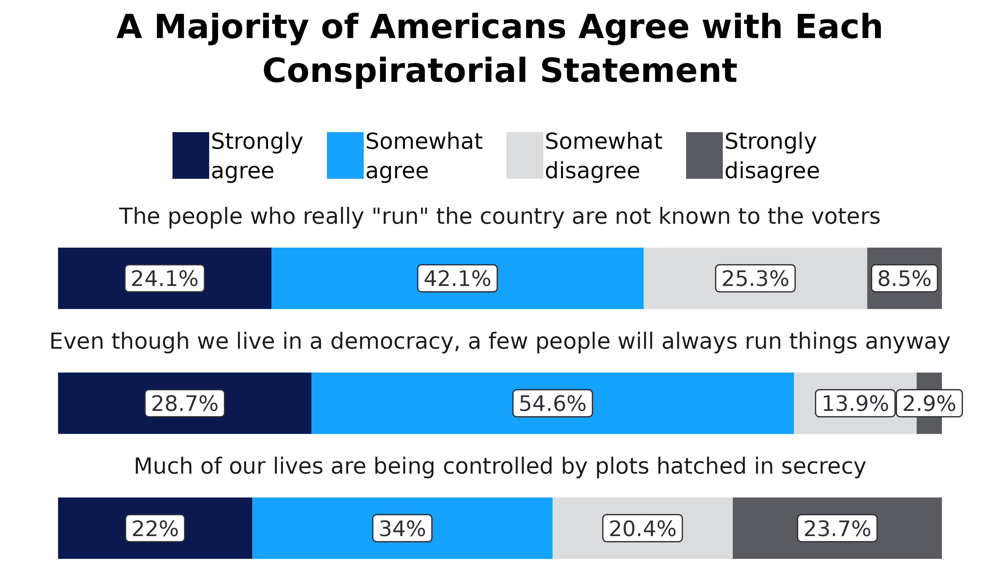
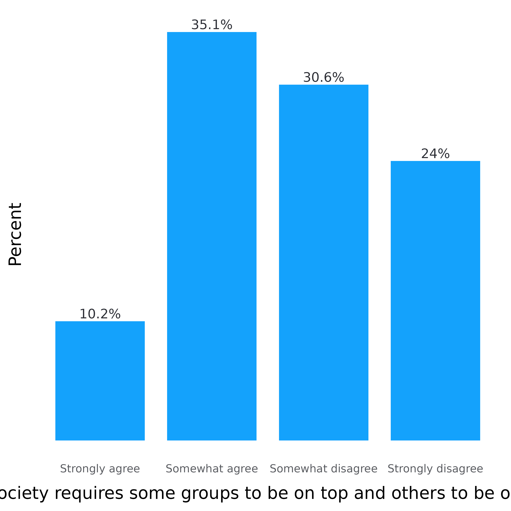

# Making bar plots

``` r
library(adlgraphs)
library(dplyr)
library(ggplot2)
library(stringr)
library(forcats)
library(haven)
library(glue)
```

At CAR, our data visualization often consists of creating bar plots.
These can be stacked bar plots or dodged/grouped bar plots, horizontally
or vertically oriented, and with or without confidence intervals. While
bar plots may not be the flashiest of graphs, they are really valuable
due to the ease at which they convey information, the amount of
information they can convey, and the fact that most people know how to
read them.

This tutorial is comprised of two parts and will likely be updated
periodically over time:

- The first part consists of a data visualization and style guide as it
  relates to creating bar plots so that they are consistent with CAR’s
  style.

- The second part demonstrates how to use various functions from the
  `adlgraphs` package to make creating bar plots easier.

## CAR’s bar plot visualization and style guide

Some general rules that apply to all bar plots:

- The title ought to be no more than two lines and ought to be the main
  takeaway of the plot.

- Subtitle can convey additional information not available in the rest
  of the plot. For example, it can help clarify what it is the plot is
  demonstrating.

- Use exact question labeling whenever possible. This is most often used
  in the axis labels but can be in title.

- The data point the bar is demonstrating should be directly labelled
  either inside or outside the bar.

- Don’t include grid lines. They are unnecessary since the labels are
  already labelled.

- Don’t label axes if not necessary.

- When it comes to deciding the direction of the plot, just use your
  judgement on what looks best. All plots used on the website require a
  width of 1080px so if you are only comparing two bars, it may be
  better to just make it horizontal. However, it’s important to keep the
  aesthetic consistent throughout a report or presentation. For
  instance, if you are regularly using vertical bar plots, keep using
  that even if some might look a little better horizontally. The change
  in orientation may confuse readers and think it is demonstrating
  something different.

### Simple bar plots

Simple bar plots are ones in which we are only comparing two variables,
the x and y axis variables. We use these for both demonstrating
frequencies as well as means. Additionally, they can be vertical or
horizontal.

Now let’s look at these in action. Below is a simple vertical frequency
plot. While this doesn’t have a subtitle, the rest of what is written
above still applies. Each bar is directly labelled with the percentage.

- There aren’t any grid lines since the bars are labelled directly

- The plot title contains the main takeaway (or a main takeaway)

- The y-axis title is not labeled since the columns are already labeled
  with data and % symbols.

- The x-axis title is the exact question wording.

- Each column is directly labeled outside the bar with the data value it
  represents and the % symbol.

- Lastly, the order of the bars is not reordered by percentage since the
  values of the x-axis already have an inherent order.


Now let’s take a look at two simple vertical mean plots. The plot on the
left shows the average score on the “American Conspiracy Thinking Scale”
across educational groups. The American Conspiracy Thinking Scale shows
the average response score across four statements. The plot on the right
shows the average number of tropes endorsed from the ADL Index.

- Both plots show the data label inside at the bottom of the bar, with
  white surrounding the number to improve visibility

- Both plots have confidence intervals demonstrating statistical
  significance

- The plot on the right does not have the y-axis labelled. This is
  because one of the bars has “Tropes Endorsed” inside of it which tells
  people what the numbers mean. This is ideal for when the y-axis is
  something easy to understand like average number of actions,
  statements, tropes, etc.


Now let’s take a look at a relatively simple horizontal bar plot. The
same principles laid out previously apply here as well, however, there
are some differences. For example, take the plot below. Here we are
looking at the percentage of people from each education level who agree
with a specific statement. Normally we would show this as a stacked plot
with all response options, but occasionally we want something simpler.
While this graph could be vertical, it is easier to read if done
horizontally. Namely, people don’t have to turn their head to read the
axes. Some notes:

- When frequency plots are horizontal, the percentage labels go outside
  the columns to the right.

- Again, the x-axis is not reordered because educational levels have an
  inherent order to them. However, if this were something without an
  inherent order, like race/ethnicity, we would reorder the columns
  based on the percentage so the top bar is highest and the bottom bar
  is lowest.

- The y-axis does not have a title because it is obvious we are looking
  at education levels. This concept applies to other demographic groups.
  Only include titles if necessary.

- While not super necessary, this graph has wrapped the y-axis labels
  (there are line breaks), this makes the graph look more symmetrical
  and keeps the x-axis title more centered. If adding line breaks try to
  keep them to three maximum whenever possible.

- The x-axis is title is added to clarify what it is we are looking it.


### Dodged bar plots

We don’t use dodged bar plots too frequently, but it is important to
understand what to do if we do use them. We use dodged bar plots to
demonstrate frequencies as well as mean plots. A typical example would
be to compare the level of agreement with various statements among
different groups of people. In this example, we’ll look at how people
with and without a college degree differ in how much they agree with a
few statements designed to measure conspiratorial mindset.

- Make sure legend is aligned with the direction of the bars and in the
  same order. We can see this in the plot below. Since the plot is
  horizontal and the bars are above each other, the legend is to the
  right and the legend items are on top of each other. Furthermore, the
  order of the legend items are in the same order as the bars.

- Another note: Since these statements were a bit long, we made the plot
  horizontal and wrapped them ove three lines. Typically, anything more
  than two or three words will be made into a horizontal bar plot. As it
  relates to wrapping the text, use your judgement. Make sure the text
  is easy to read, doesn’t overlap with each other, and the relative
  sizes of the bars is easy to see.

&nbsp;

    #> Adding missing grouping variables: `edu_f2`, `conspiracies_f`
    #> Warning in scale_adl(palette = "binary", wrap_legend_labels = 25, legend_title
    #> = "none"): `n` has been deprecated as the function now automatically detects
    #> number of colors needed.


Occasionally, we also do vertically dodged bar plots. As I mentioned
above, we’ll use these when the axis labels are not large. For example,
comparing the percentage of people endorsing different numbers of
tropes/statements among different groups, like college graduates vs
non-college graduates. Another example, comparing the average score for
two measures, like conspiracy belief and social dominance orientation,
across a group, like education level. I’ll demonstrate both examples
below.

    #> Warning in scale_adl(palette = "binary", wrap_legend_labels = 20, legend_title
    #> = "Average Score:"): `n` has been deprecated as the function now automatically
    #> detects number of colors needed.


### Stacked frequency bar plots

This one of the most common bar plots CAR uses. We use horizontal
stacked plots to demonstrate frequencies of different statements. We do
not use vertical stacked plots. Here are some general notes unique to
horizontal stacked plots:

- When comparing frequencies of different statements, the legend should
  almost always go on top.

- Each statement goes above the bar instead of to the left of it.

- Each bar should be labelled. The labels should have white backgrounds
  for added visibility and should be centered within the bar. If two
  labels overlap, manually adjust their spacing.

- The order of the response options goes like this: agree to disagree;
  true to false; favorable to unfavorable; etc. When used within the
  same report, it is important to keep the order of the response options
  the same in every graph. Generally, we want the value we are
  highlighting to come first. Oftentimes, this is the percentage who
  think a negative statement is true or agree with it.

- The order of the statements should go from highest (on the top) to
  lowest (on the bottom)

&nbsp;

    #> Warning in scale_adl(palette = "likert_4", n = 4, wrap_legend_labels = 10, :
    #> `n` has been deprecated as the function now automatically detects number of
    #> colors needed.



## How to create bar plots using the `adlgraphs` package

This section is going to walk you through the graph creation process
step by step. The main functions from this package that we will use are:

- [`get_means()`](https://jdenn0514.github.io/adlgraphs/reference/get_means.md):
  Calculate means and confidence intervals.

- [`get_freqs()`](https://jdenn0514.github.io/adlgraphs/reference/get_freqs.md):
  Calculate frequencies.

- [`pct_conv()`](https://jdenn0514.github.io/adlgraphs/reference/pct_conv.md):
  Convert the results in
  [`get_freqs()`](https://jdenn0514.github.io/adlgraphs/reference/get_freqs.md)
  to be easier to use in graphs by multiplying the `pct` values by 100
  and creating a new variable called `pct_lab` that takes the `pct`
  values and adds the “%” symbol.

- [`adl_bar_plots()`](https://jdenn0514.github.io/adlgraphs/reference/adl_bar_plots.md):
  Take the prepared data and make a bar plot.

- [`scale_adl()`](https://jdenn0514.github.io/adlgraphs/reference/scale_adl.md):
  Set the colors and adjust other stuff related to the legend

- [`theme_default()`](https://jdenn0514.github.io/adlgraphs/reference/theme_default.md),
  [`theme_v_bar()`](https://jdenn0514.github.io/adlgraphs/reference/theme_v_bar.md),
  [`theme_h_bar()`](https://jdenn0514.github.io/adlgraphs/reference/theme_h_bar.md),
  [`theme_h_stack()`](https://jdenn0514.github.io/adlgraphs/reference/theme_h_stack.md):
  Adjust the visual appearance (theme) of the bar plot. These are
  already included in `adl_bar_plot()` so you won’t need to use these
  very often.

#### Graph 1

Let’s start off by making the first graph presented in this vignette.
First, we need to get the data for the graph. To do that, we’re going to
convert the variable `top` into a factor variable named `top_f` by
leveraging the the underlying metadata with the
[`make_factor()`](https://jdenn0514.github.io/adlgraphs/reference/make_factor.md)
function. Then, we use
[`get_freqs()`](https://jdenn0514.github.io/adlgraphs/reference/get_freqs.md)
to calculate the frequencies.

``` r
# use the test data set
df <- test_data %>% 
  # convert top_f into a factor variable based on the underlying labels
  mutate(top_f = make_factor(top)) %>% 
  # calculate the weighted frequencies
  get_freqs(top_f, wt = wts) 

df
#> # A tibble: 4 × 3
#>   top_f                 n   pct
#>   <fct>             <dbl> <dbl>
#> 1 Strongly agree     25.1 0.102
#> 2 Somewhat agree     86.1 0.351
#> 3 Somewhat disagree  75.0 0.306
#> 4 Strongly disagree  58.9 0.240
```

If the variable does not have value labels, then we can manually make a
new variable a factor with the correct response options using
\[[`case_match_fct()`](https://jdenn0514.github.io/adlgraphs/reference/case_match_fct.md)\],
like what’s below. We can see that the results are the exact same, but
the example below requires a lot more code (This is why metadata is so
valuable!).

``` r
test_data %>% 
  # make top_f and set the factor levels using case_match_fct()
  mutate(top_f = case_match_fct(
    top,
    1 ~ "Strongly agree",
    2 ~ "Somewhat agree",
    3 ~ "Somewhat disagree",
    4 ~ "Strongly disagree"
  )) %>% 
  # calculate the weighrted frequencies
  get_freqs(top_f, wt = wts)
#> # A tibble: 4 × 3
#>   top_f                 n   pct
#>   <fct>             <dbl> <dbl>
#> 1 Strongly agree     25.1 0.102
#> 2 Somewhat agree     86.1 0.351
#> 3 Somewhat disagree  75.0 0.306
#> 4 Strongly disagree  58.9 0.240
```

Okay, now that we have the data, let’s make it easier to use in the
graph with the
[`pct_conv()`](https://jdenn0514.github.io/adlgraphs/reference/pct_conv.md)
function. This function takes the `pct` variable multiplies it by 100
and then takes that value and adds the % symbol in a new variable called
`pct_lab`. We can see this below.

``` r

df <- df %>% 
  # clean up the data
  pct_conv()

df
#> # A tibble: 4 × 4
#>   top_f                 n   pct pct_lab
#>   <fct>             <dbl> <dbl> <chr>  
#> 1 Strongly agree     25.1  10.2 10.2%  
#> 2 Somewhat agree     86.1  35.1 35.1%  
#> 3 Somewhat disagree  75.0  30.6 30.6%  
#> 4 Strongly disagree  58.9  24.0 24%
```

Now that we have the data for a frequency plot properly set up, we can
make the bar plot. To do this we will use the
[`adl_bar_plots()`](https://jdenn0514.github.io/adlgraphs/reference/adl_bar_plots.md)
function and because this a simple graph, we only need to specify `x`,
`y`, and `col_label`. We set `x` to “top_f” so that the graph is
vertical and the response options are on the x-axis. We set `y` to “pct”
so that the bars set to the heights of the percentage. Moreover, we need
`y` to be a numeric value. `col_label` is set to “pct_lab” and is the
label that goes outside the bars.

``` r
plot <- df %>% 
  adl_bar_plots(
    # set the x-axis to top_f so it is vertical
    x = top_f,
    # set the y-axis to the pct 
    y = pct,
    # set the variable that is used for the labels
    col_label = pct_lab
  ) 

plot
```



Now we need to add the plot title and axis title using
[`labs()`](https://ggplot2.tidyverse.org/reference/labs.html). We don’t
need the y-axis title so set `y = NULL`. We are going to use
[`attr_var_label()`](https://jdenn0514.github.io/adlgraphs/reference/attr_var_label.md)
to get the variable label, so set `x = attr_var_label(test_data$top)`.

``` r
plot <- plot + 
  labs(
    y = NULL,
    x = attr_var_label(test_data$top),
    title = "About 40% of Americans Think an Ideal Society is Hierarchical"
  )

plot 
```


Unfortunately, the x-axis title is too long. Since we are using
[`attr_var_label()`](https://jdenn0514.github.io/adlgraphs/reference/attr_var_label.md),
we need to use
[`stringr::str_wrap()`](https://stringr.tidyverse.org/reference/str_wrap.html)
to wrap the x-axis title. We are setting it to 55 so that the line break
occurs after 55 characters. The plot title is also too long so we need
to fix that as well. One way to do this is to use
[`stringr::str_wrap()`](https://stringr.tidyverse.org/reference/str_wrap.html)
again, or we can manually set it by adding `\n` to the title. `\n`
indicates where the line break should occur.

``` r
plot <- plot +
  labs(
    y = NULL,
    x = str_wrap(attr_var_label(test_data$top), 55),
    title = "About 40% of Americans Think an Ideal\nSociety is Hierarchical"
  )
plot
```


#### Creating dodged bar plots

#### Creating stacked bar plots

#### Switching the order of the axes

### Using `scale_adl()`

##### Using scale_adl
